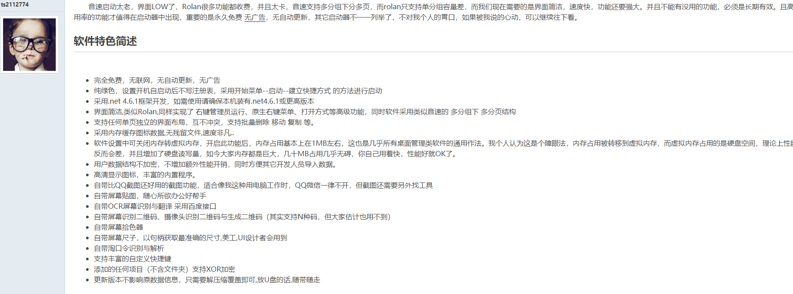
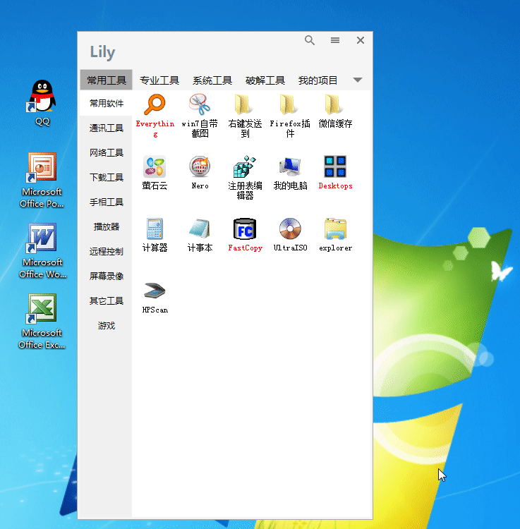
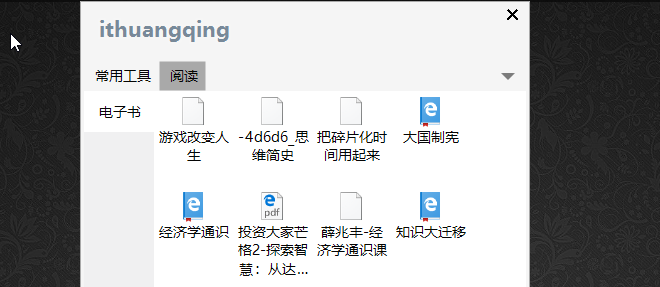
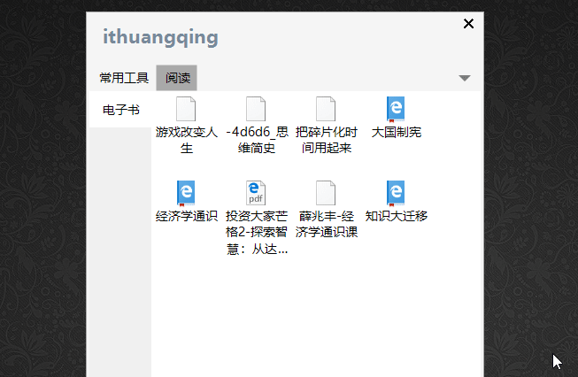
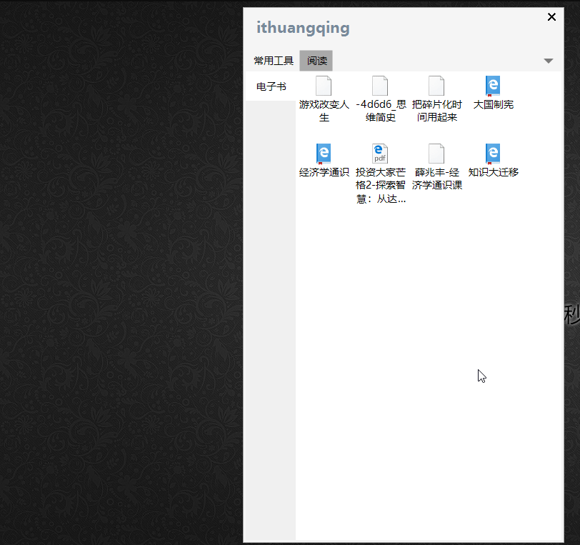
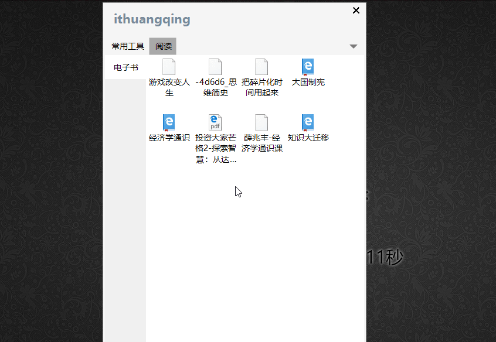
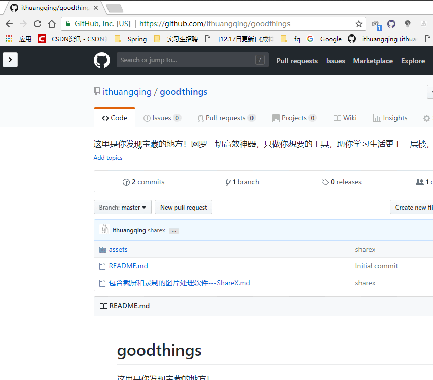
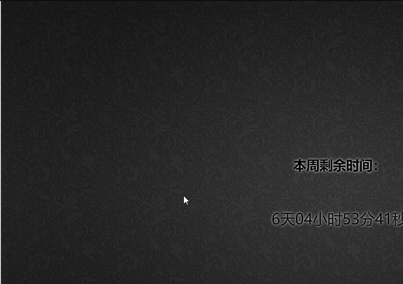
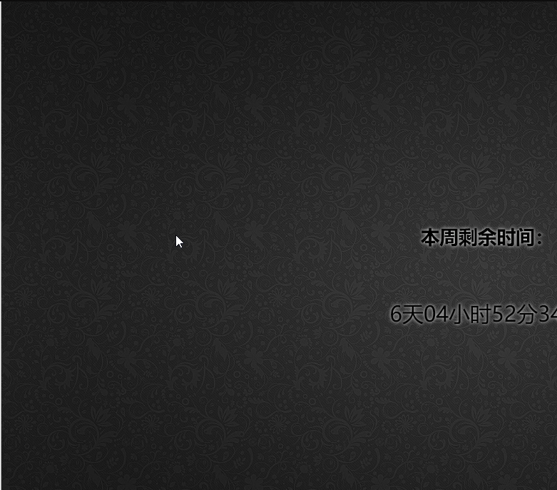

音速启动太老，界面LOW了，Rolan很多功能都收费，并且太卡，音速支持多分组下分多页，而rolan只支持单分组容量差，而我们现在需要的是界面简洁，速度快，功能还要强大。并且不能有没用的功能，必须是长期有效。且高使用率的功能才值得在启动器中出现，重要的是永久免费 [无广告](https://www.52pojie.cn/forum-2-1.html)，无自动更新，其它启动器不一一列举了，不对我个人的胃口，如果被我说的心动，可以继续往下看。 

对，以上不是我说的，这是吾爱破解论坛的一个大神说的，这位大神自己做了这么一个软件（无线崇拜）

奉上截图，开始仰望

那这是个什么软件呢？

 

有没有很吸引人，这个工具简单来说就是可以将你的文件啊，文档啊，或者是网站啊什么的都可以集中在一起管理，这个对那些极简主义者我倒是觉得蛮合适的。

我下载体验了一番，满意，不错。

这里的主界面名称是可以修改的。

这个工具是可以吸附在屏幕边缘的

下面再具体说一下这个工具的功能。

以上是演示如何增加横向标签栏和纵向标签栏，大家可以自行添加，然后我们可以在里面保存一个网页，方便下次直接打开

可以看到，还是很方便的，初次之外我们还可以将我们的大部分应用文件都放在这里面

其他的功能就需要你自己去摸索的，比如说这个

所以呢，强烈建议自己下手体验一把！

> 这是链接https://www.52pojie.cn/thread-724933-1-1.html

再次感谢这位大神！

