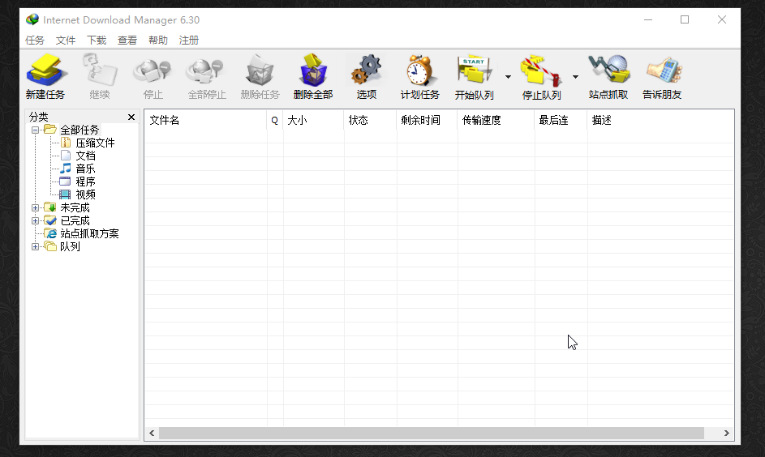
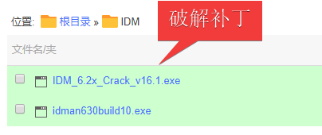
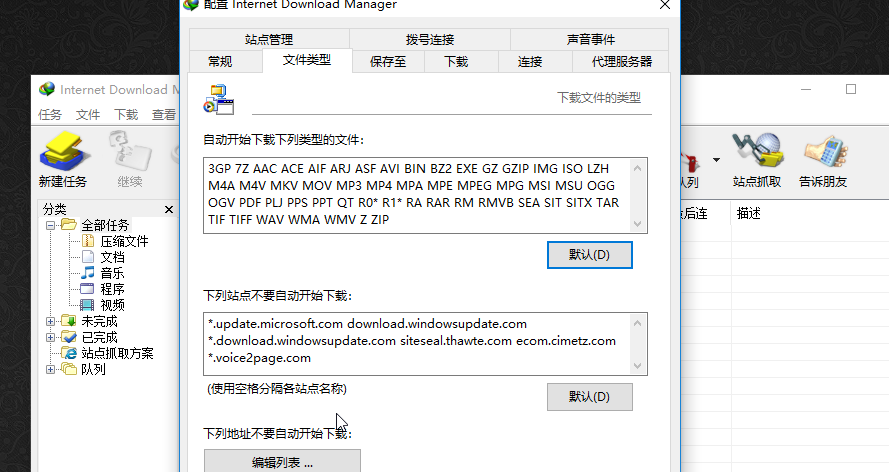
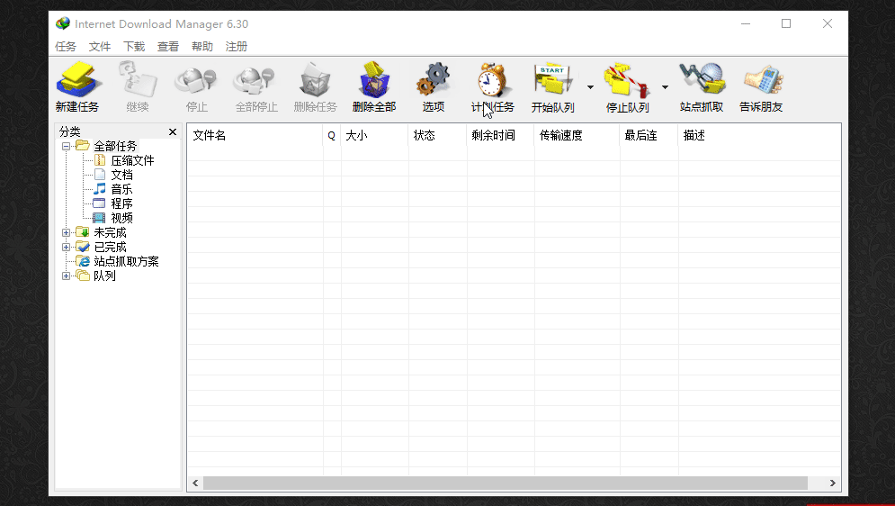
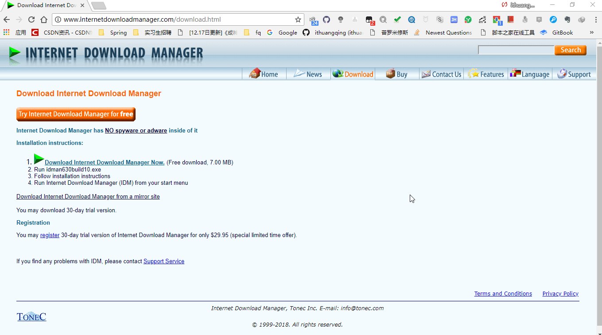

现在大部分人应该使用百度云比较多吧，想必使用百度云的也都知道一个神器叫做它，好了，先不说等会写一个专门的帖子主要下载百度云资源的吧，今天的主题是IDM。

这个不知道大家有没有不知道的，先来个软件的截图吧！

初次使用真的被他的速度惊呆了。

Internet Download Manager，简称 IDM，是国外的一款优秀下载工具。目前凭借着下载计算的速度优势在外媒网站中均受好评，现在已被多数国人熟知。Internet Download Manager 提升你的下载速度最多达5倍，安排下载时程，带有续传功能，可以恢复因为断线、网络问题、计算机当机甚至无预警的停电导致下传到一半的资料。

IDM具有动态文件分割、多重下载点技术，而且它会重复使用现有的联机，而不需再重新联机登入一遍。智能in-speed技术会动态地将所有设定应用到某种联机类型，以充分利用下载速度。IDM支持下载队列、防火墙、代理服务器和映摄服务器、重新导向、cookies、需要验证的目录，以及各种不同的服务器平台，它紧密地与Internet Explorer和Netscape Communicator结合，自动地处理你的下载需求。此外，IDM还具有下载逻辑最佳化功能、检查病毒，以及多种偏好设定。

> 这是它的官网：<http://www.internetdownloadmanager.com/> 

我刚开始从官网下载这个IDM的时候下载速度特别慢，要知道这个IDM就7M，怎么会下载这么慢，而且第一次还下载中断，第二次大概五分钟多才下载完，不知道为什么特别慢，然后IDM搞定后我使用IDM下载试试刚点击下载就提示已完成，说真的，被吓到了，这丫太快了，没有对比就没有伤害啊。

这个IDM本身是英文的，但是在安装的时候会让你选择语言，这个倒是没有什么大问题，不过这个IDM是付费的，这次会给大家一个破解补丁，一共两个文件

大家在下载完成IDM之后将这个破解补丁复制到IDM的安装目录然后打开点击点击 Crack IDM 按钮进行破解。 

对了安装完成之后IDM会弹出几个框，大概是为你的浏览器安装对应的插件，你选择启用插件程序即可，然后我们看这个。

我们看到这里有一个自动开始下载下列类型的文件，意思就是你在浏览器中下载这些文件的时候回自动被我们的IDM截获，然后通过IDM进行下载，下面我们做个演示。

我们这里就以下载IDM为例，当你点击下载之后会被IMD给拦截 ，然后通过IDM来下载，可以看到下载还是相当快的，接下来我们再使用普通下载看看速度

不过我们首先需要知道这么一件事，就是现在你可以试一下，只要是从浏览器中下载东西都会被IDM给截获，那么有没有什么办法使得本次下载不使用IDM呢？答案是有的。

这里的意思就是你在下载之前如果按住Alt之后再点击下载链接就不会使用IDM进行下载了，我们来看下。

可以仔细观察这里的下载速度，有一种急死人的赶脚！

好了，赶快用上这个神器吧！

下载地址：https://www.lanzous.com/b276491/  密码:3hbg 