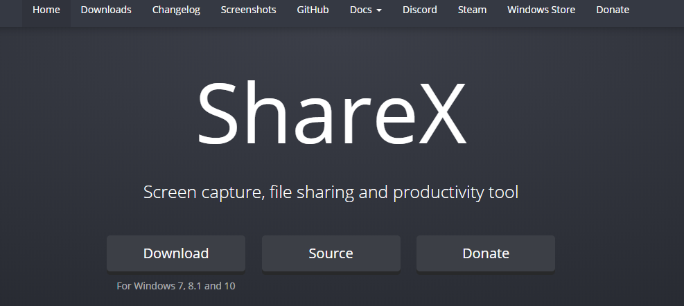
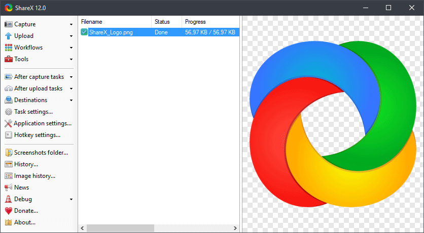
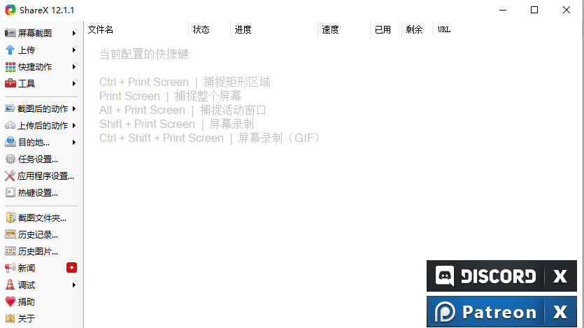
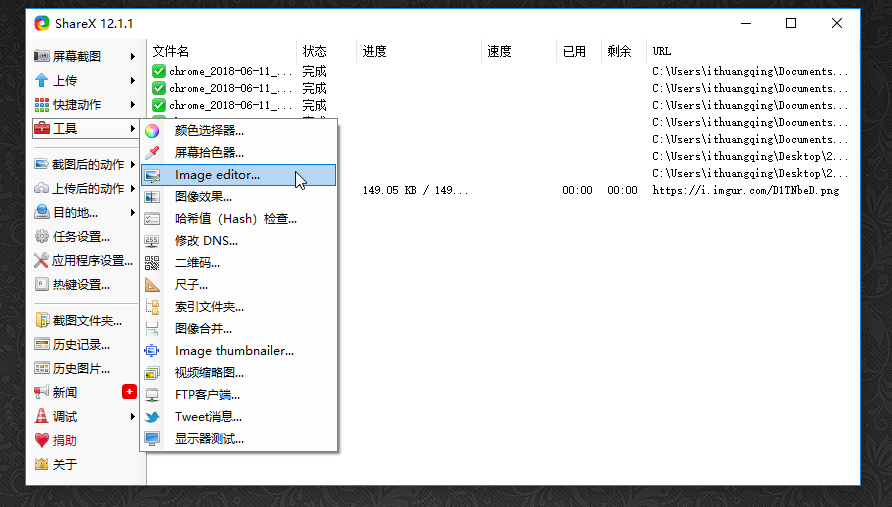
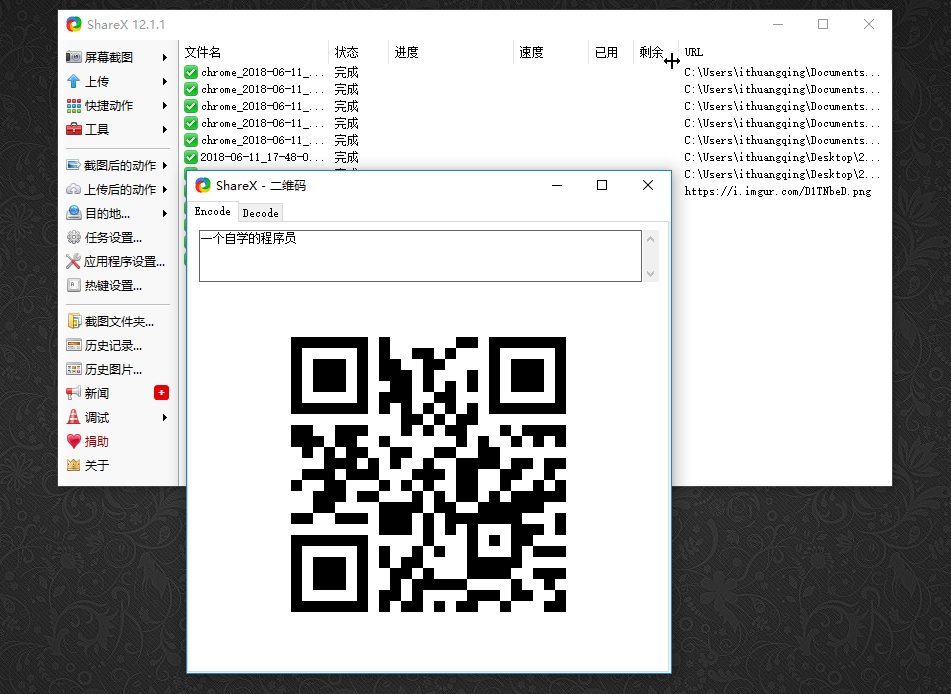
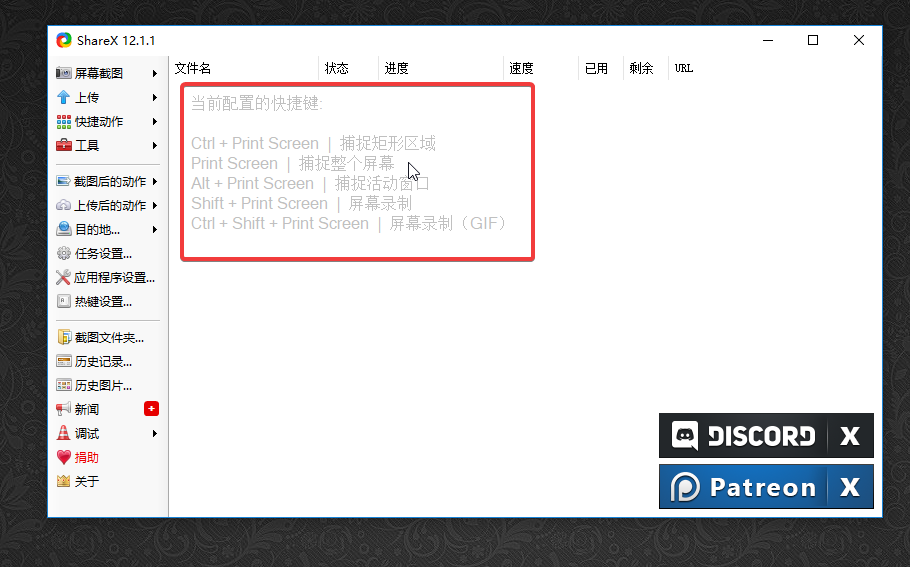
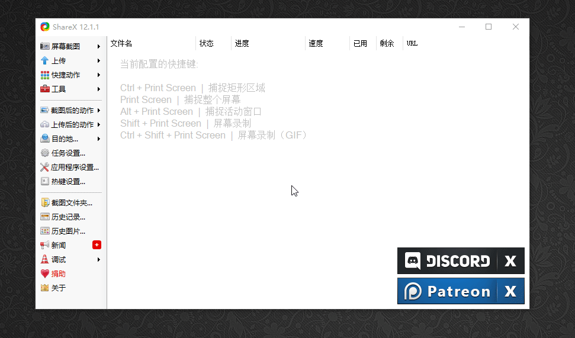
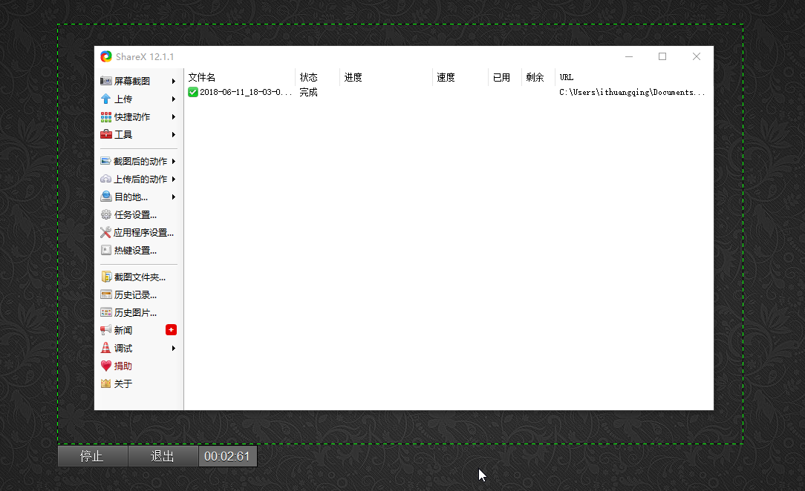
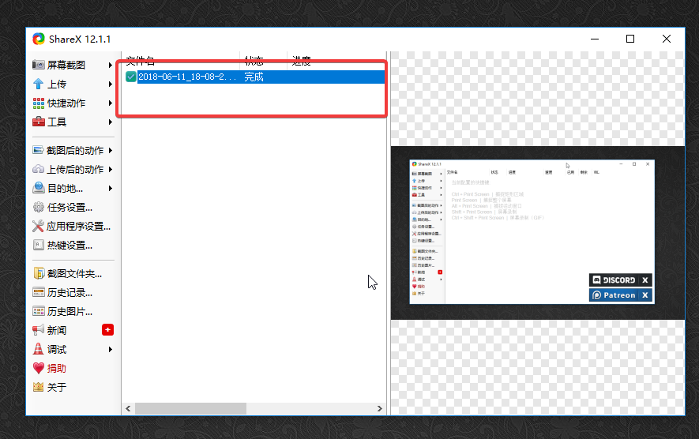
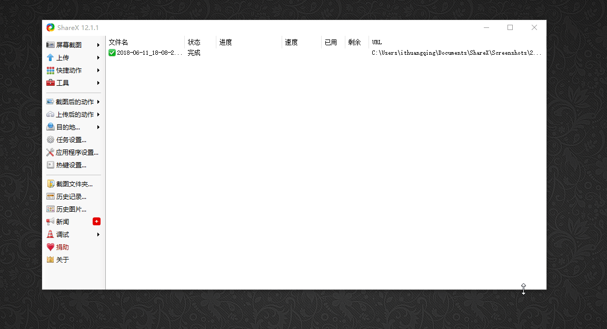

## 吓死你的图片处理软件---ShareX

> 官方网址：https://getsharex.com/

官网截图

 

这是英文的，作为一个英语从小就差的我，必须把它搞成中文的。哦，原来只要一安装就变成中文的啦！（其实我是故意的）

以上就是安装完成之后的样子。其实当我看到以上这个画面的时候我的内心是激动的，你有没有感觉这货真的有点强大了。截图，屏幕录制，gif制作都有，说好的图片处理软件呢？

其实关于图片处理的功能在这

我们看到这里有一个工具，这一栏里有隐藏很多功能，其中有关于图片处理的功能，除此之外还有拾色器，二维码制作等。

在这里直接输入文字就可以生成特定的二维码，还是相当好用的。

不过我觉得这个工具最赞的应该还是它渐染提供截屏和录屏的功能，这个是很有用的，让我们一起来看下。

其中我们安装刚刚完成的时候这里有一段文字提示，不知道你注意到没

这里对截屏和录屏的快捷键都有提示，可以说是相当好用，我迫不及待的测试了下gif制作

结果弹出了这个，那就下载

以上就是屏幕录制的gif的，可以看到效果还是不错的。

你开启屏幕录制gif之后会让你选择区域，之后就是上图这个样子了，录制完成之后点击左下方的停止，然后会出现这个（要稍等一小小会）

这个就是你录制的gif了，然后可以找到源文件

这里一定要注意，当你录制完成点击停止之后，一定要等待一会才会出现你录制的gif，这个可能是需要进行相关的转码设置，而且时间长短跟你录制的gif时间长短有关。

接下来我们再一下它的屏幕录像功能如何，经过测试，这个屏幕录像的功能好像不能录制声音，也许是自己没有摸索好，，不过这个工具包含的其他强大功能，基本上可以满足你的大部分需求了，我经常使用的两大功能就是截屏和gif制作，所以这个软件对我来说很不错。

适不适合你，只有自己试过才知道！

