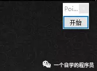
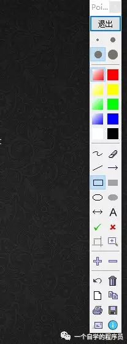
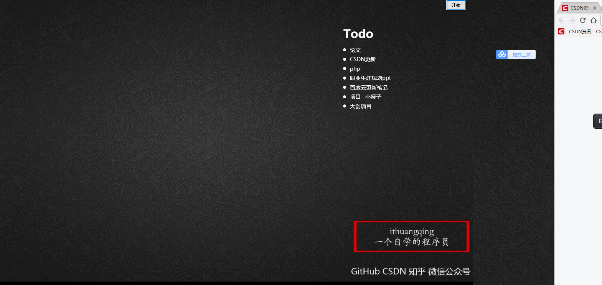
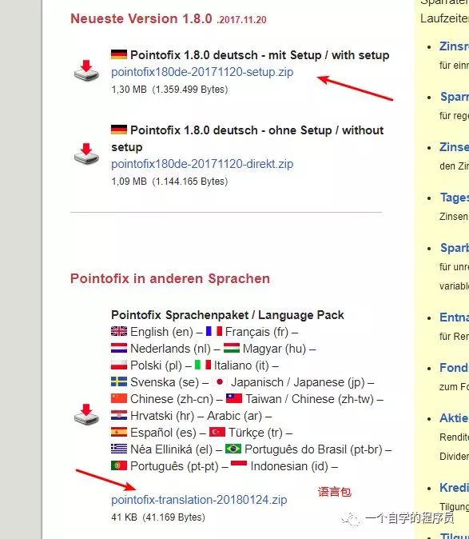
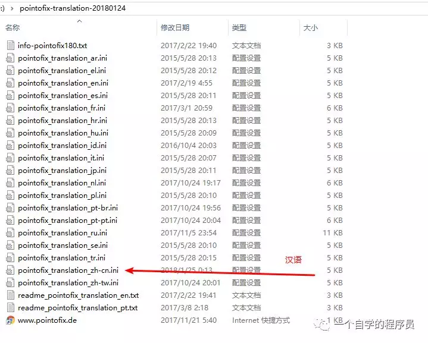
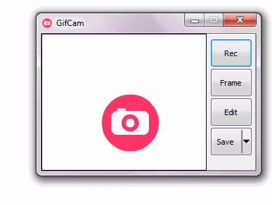
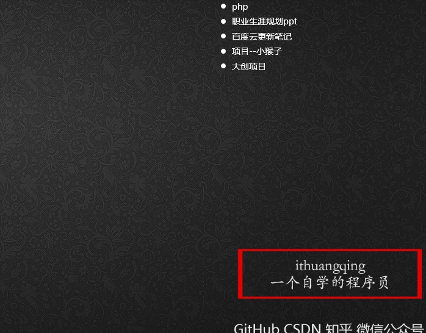
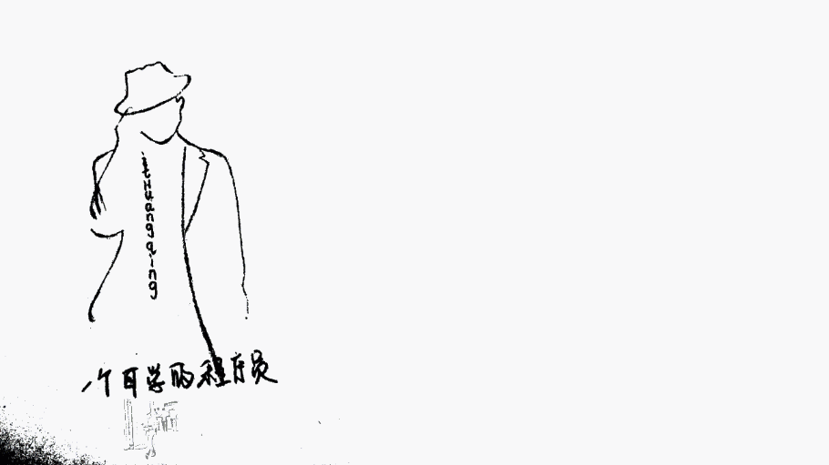

 

**神器再多，这五个必备！**

话不多说，直接开说！

**第一个：Pointofix**

可以说，这个是我的最爱，你初次用这货感觉它跟我们平常用的画板有点像，但是当你真正的去使用它，你会发现，它简直吊炸天，首先你现在安装完成之后会在你的电脑右上角出现这个

 

点击开始，这就厉害了 

 

这时候你要记住，此时你的**电脑桌面就成了一个画板**，来我们看看 

 

你可能说，我不想在当前桌面上进行绘制，能不能新建一个画板，当然可以啦！ 

 

我们可以看到，这里可以新建好几种的画布，基本满足你所有的无需求，当然，他可能还有更多强大的功能，这就需要你去发掘了！

**官方下载地址：http://www.pointofix.de/download.php**

 

这里大家不仅要下载安装包，还要下载下方提供的语言翻译包，因为本身的安装包自带的好像是其他语言，反正看不懂，我们将翻译语言包下载解压之后发现是这个样子的！ 

 

然后找到你的安装目录，看图操作，这样工具语言就会变成中文 

 

看懂了吗？其实就是**将翻译语言包中的中文配置文件复制进安装目录，并且修改名称（看图），然后重启即可！**

**第二个：GifCam**

在介绍上一个神器的时候，我放了几张Gif图片，大家看效果还是非常不错的吧！这个绝对称得上是神器，录制gif，简直太方便太好用，而且大小不超2M，唉不说了，赶紧下载吧！

来看看这个神奇的家伙

 

打开之后它会置顶在你的桌面，然后你可以随意的拖动，改变要录制的区域，简直太强大有木有，而且，它同样有更强大的功能等你去玩耍，赶快下载吧！

**官方下载地址：https://gifcam.en.softonic.com/**

**第三个：Snipaste**

号称三年磨一剑打造的这款软件，简单强大让你好用到爆的免费截屏软件，其实我之前都是在用扣扣截屏的，看来该提高一下逼格了！

 

当你去使用它的时候，你就会发现，真的屙屎简单而又强大，不说了自己体会！

**官方下载地址：http://www.snapfiles.com/get/snipaste.html**

**第四个：天若OCR文字识别**

这个是一个个人开发的，此人必定大神，不过这款恐惧确实好用，提到OCR，想必大家都知道是什么，这个确实很有用，而且识别还挺准确，你来看看

 

它这个识别的时候是有动画的，挺好玩的，它还有一个强大的功能 

 

只能双击666了

**这个好像没有官网，可以在这里找到：https://www.52pojie.cn/thread-692917-1-1.html**

这里提出作者给的网盘链接：**https://pan.lanzou.com/i0wwvni**

**第五个：Ditto**

这是最后一个，不过我不介绍了，详情百度！

**为什么不介绍？**

（我女朋友六点叫我吃饭，我在写这篇文章，现在快八点了，所以不能再介绍了，即使没介绍完，毕竟**对象最重要**！）

 

