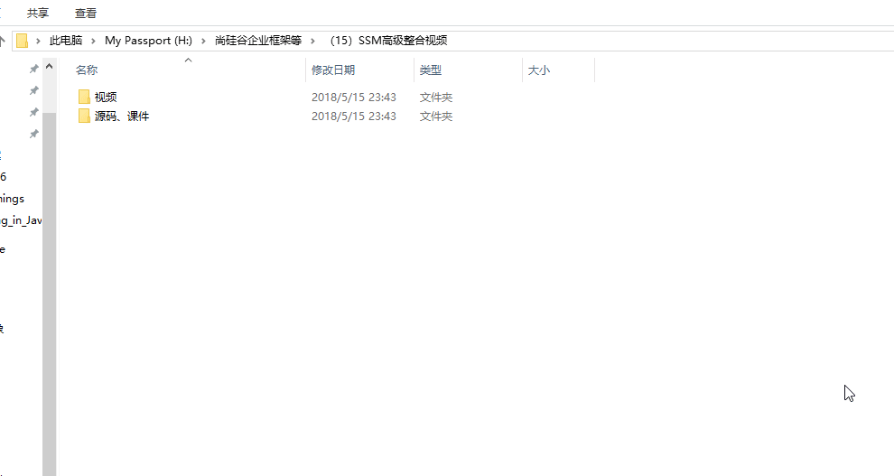
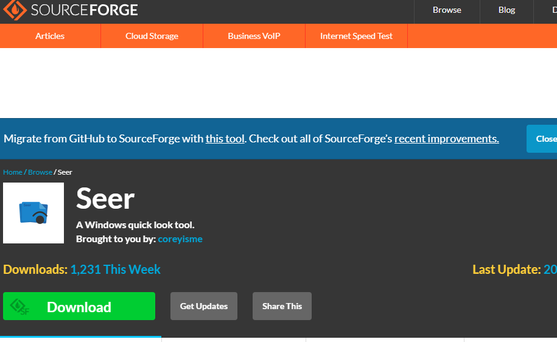
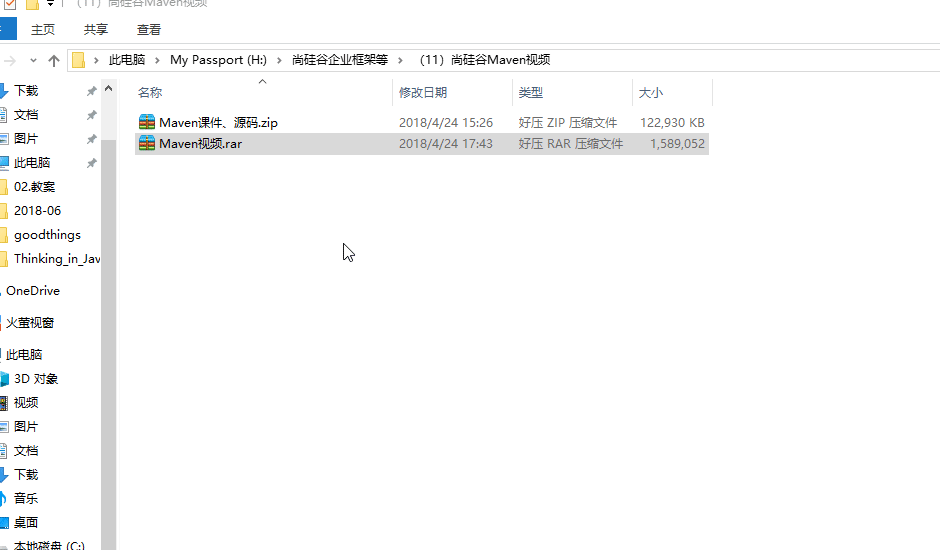
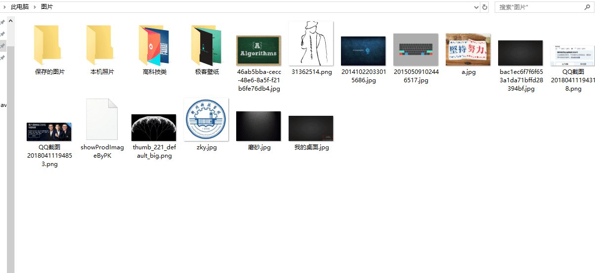

简直太强大要不要，你看

话说你看懂了吗？那我就说一下，这里这个压缩文件我并没有解压就可以直接预览压缩文件中的内容了，有没有发现这个功能很实用呢？我们平常难免会遇到一个很大的压缩文件解压缩之后却发现并不是自己想要的，直接尴尬了，如果能在压缩之前看一下里面的内容是不是我想要的那就好了。

现在这个工具来满足你，它就是强大的预览工具----seer，号称没有它不能预览的文件，下面不多说先把它下载下来

> 这是官方地址：https://sourceforge.net/projects/ccseer/

是这个样子的

点击下载即可，然后一步步的安装就行，安装完成之后那就厉害了，任何文件只要选中它，按一下空格键就可以预览了，注意是任何文件。

**压缩文件**

**图片**

**文件**

简直太强大有木有，还不赶快下载体验一波！

