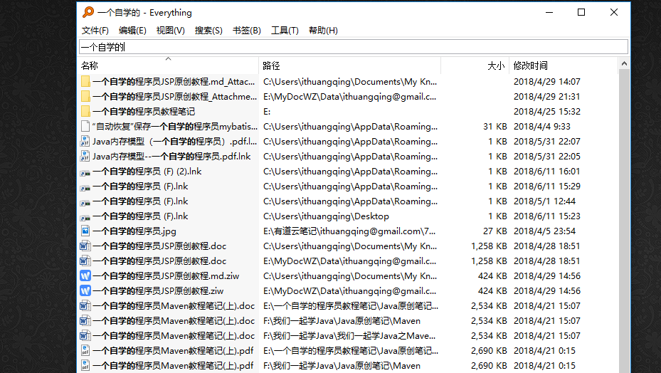
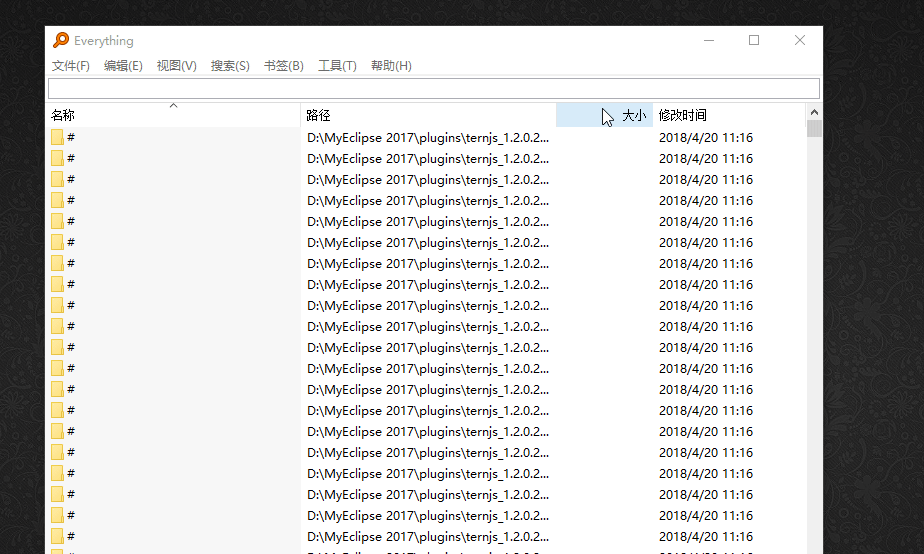

关于这个搜索工具想必大家都知道这个EveryThing，大家也许都用过，这个确实好用，但是在我接触到它----listary之后我就不再使用EveryThing了，因为个人觉得listary更加好用一点。

不过我要声明一点，EveryThing和listary都是非常强大的工具，我目前也就是会使用他们快速查找一个东西，至于他们各自的精准话功能我都不怎么会用，也就是说我并没有真正完全发挥他们的作用，感兴趣的可以好好研究他们的功能，绝对又让你惊喜的地方，今天在这里只是介绍两款软件的基本使用----查找

这就是我们熟知的EveryThing，它也可以创建快捷键来快速启动

下面我们来说一下这个listary，关于这两个软件我们都可以百度搜索到下载地址，所以这里就不说如何下载了，安装完成listary之后你直接可以双击ctrl就可以快速启动它。

这个感觉更加方面，然后我们测试一下

我的目的是要搜索微信这个应用，就结果来看，listary让我更加满意一点。

至于哪个更加好用，还需要你自己亲自体验一才知道效果！

