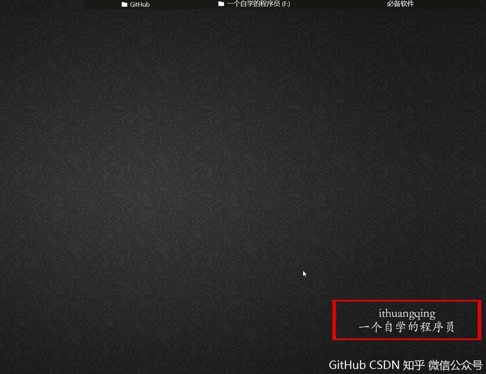
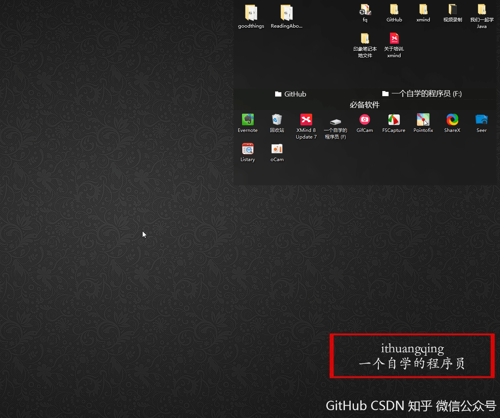
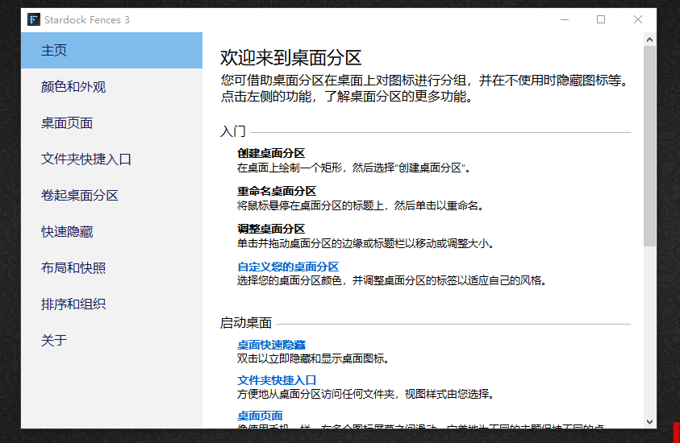
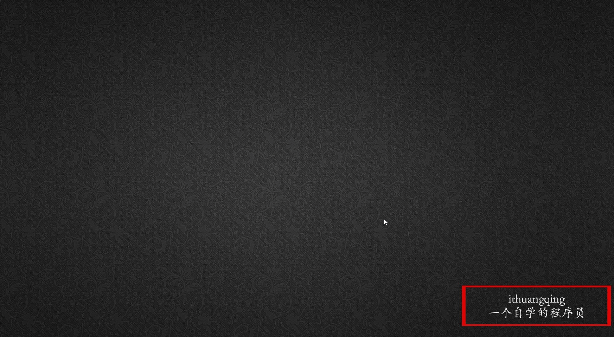

这个是什么东西呢？我们先来看看我的桌面

怎么样还不错吧！还有这个操作

看到了吧，就是我双击可以隐藏我的桌面，这个工具我一直在用，真心感觉不错哦，下面我们一起来看下吧。

Stardock Fences 是著名的 Stardock 公司新推出的一款软件，用来分类和组织桌面上的图标。它可以将不同的图标放到不同的半透明“容器”当中，你还可以移动和拉伸这个“容器”。这样将图标分类以后，你的桌面再也不会看起来一团糟了。此外，Fences还提供了一个有趣的功能：双击桌面，隐藏所有图标；再次双击桌面，显示所有图标。 

不过，这个软件是收费的，不过不用担心，等会会给你破解版下载链接

这个软件安装之后会有这个

就是会有一些教程教你怎么使用，很简单的，因为教程说的足够清晰，我这里给大家演示一个最基础的功能。

怎么样，使用起来是相当的简单，不过这个软件也确实好用，给你破解版的下载链接，赶紧下载体验一番吧！

> 破解版下载链接：https://www.lanzous.com/b276400/  密码:ithuangqing 