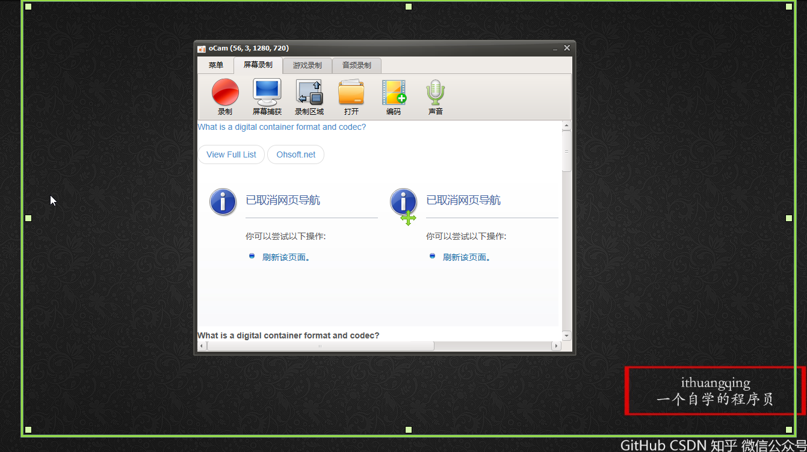
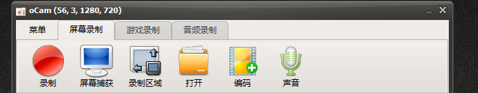
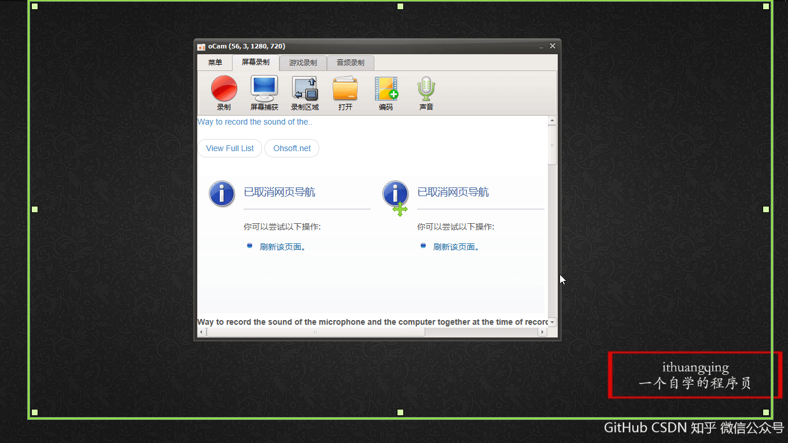
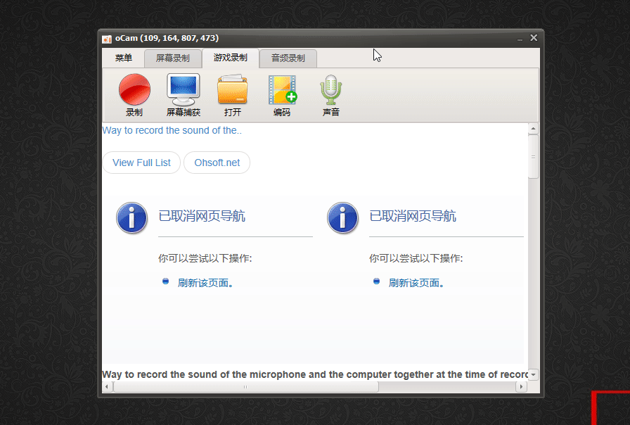
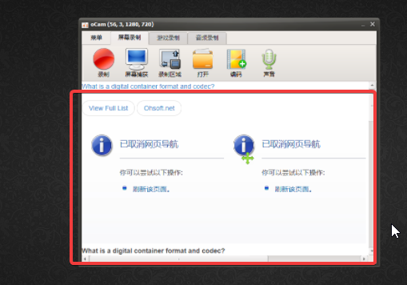
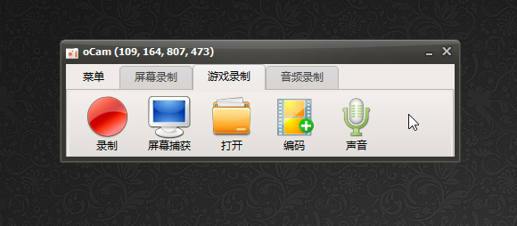

我相信对于大部分人来说，视频录制也是一个不小的需求，而且关于视频录制的软件也不少，那么我们该如何选择呢？

我有如下几点参考

1. 体积小，尽量希望软件不要太大，节约内存嘛。
2. 使用起来简单，这个很重要，毕竟我是个怕麻烦的人。
3. 功能简洁明了，上手容易，其实还是使用起来简单
4. 最好免费

基于以上几点参考，我最终选择了oCam这个录屏软件。

oCam 是韩国 ohsoft 公司开发的高清录像软件，好用免费，而且功能强大，不仅仅能进行屏幕的录制，还能够进行屏幕的截图和游戏录制，另外，oCam 还支持录制 GIF。在使用 oCam 的时候，你可以选择全屏模式录像，也可以选择自定义区域录像。该软件使用方式非常简单，预设会有一个框架，可以自己调整框架的大小，点选录制就开始录像了。 

这款oCam录像软件基本可以满足你所有的要求了，下面我们一起来看一下。

> 这是官方网址：https://download.cnet.com/oCam/3000-13633_4-75758209.html

首先下载安装之后是这个样子的

这个软件下面有一些广告什么的，不要管它，我们只关注这些

我们看到此时处于屏幕录制阶段，我们的而桌面也出现了一个绿色的矩形，这就是录制区域了，我们可以这样操作这个录制区域

操作起来是不是很方便，下面我们可以做一下修改

我们可以给录制的视频添加水印，改变录制视频保存的位置等。

至于如何录制也非常的简单，单机录制即可开始录制，单击停止则结束录制，具体的效果需要你亲自试一下！

反正我是觉得挺好用的！

不过这个软件就有一点不满意就是这些了

这些其实是广告，人家都是免费的了，有点广告也是合情合理啊，不过要是没广告那就更爽了，来你看看这个

对，你没看错，这个没有广告了，但是它的录制区域的选定则没有那么灵活了，这个是去广告版的，下载链接给你，具体适不适用就看你自己了。

> 去广告版：https://www.lanzous.com/i17crbi
>
> 

