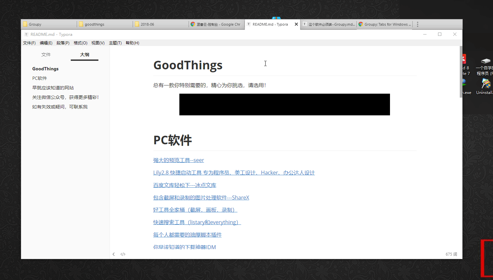
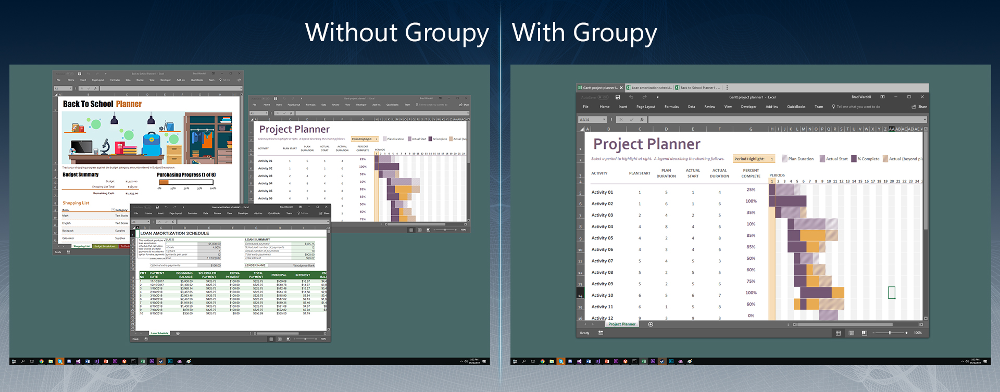

首先，我们来看一下我桌面现在打开的应用或者文件

你不会觉得没有什么不同吧，有没有发现我这里跟浏览网页一样在浏览打开的应用或者文件吗？

Groupy 就是这样的一款工具，它可以帮助你实现像浏览网页一样来浏览已经打开的应用或者文件，也就是说它可以把你打开的所有软件整合在一起，形成tab的方式来供你切换，我们来看一下两者的区别。

 

我们可以看到左边是我们没有使用 Groupy 也就是正常打开一些软件的样子，这些软件之间是相互独立的，但是使用我们的Groupy 之后，所有的软件就被整合在一起了。

如此一来你就再也不用因为切换不同的应用而苦恼的，我们可以向浏览网页一般浏览我们打开的应用。

ok，我觉得以上这个演示已经把这个软件的精髓说到了，这个软件是收费的，下面是福利版。

传送门：https://www.lanzous.com/b277036/  密码:cps0 