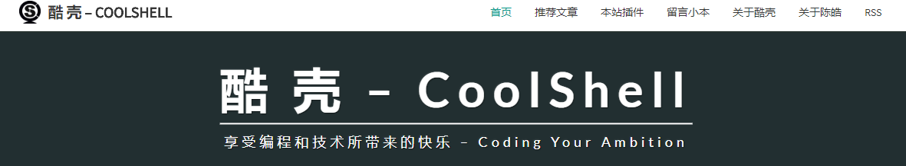
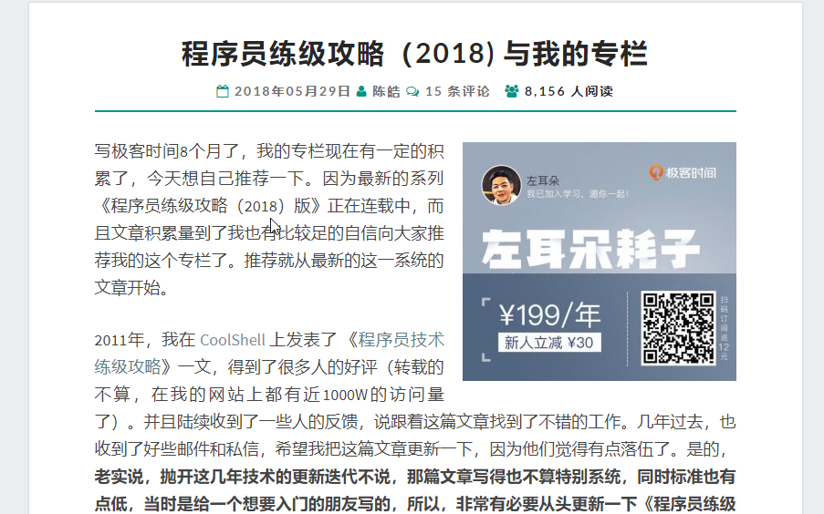

这个左耳朵耗子大叔想必为很多人知晓，行业老兵，骨灰级程序员，这个你一定更熟悉

、

多么熟悉的一个网站啊，最近耗子叔在极客时间上开专栏了，最吸引我的是这个

耗子叔要在极客时间专栏上更新他的程序员练级攻略了，我们看看目录。

 

 

 

 

我是觉得很有吸引力，有兴趣的可以看下这篇文章：https://coolshell.cn/articles/18360.html

重点是耗子叔的这个博客非常值得推荐关注：https://coolshell.cn/