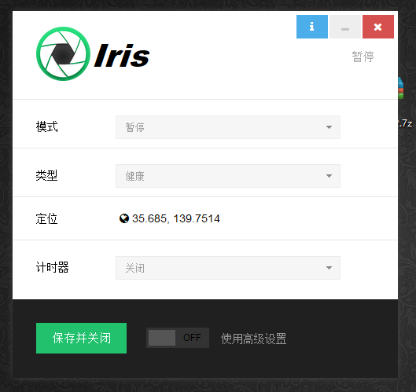
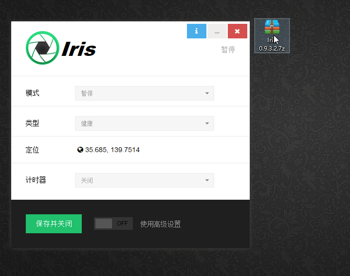
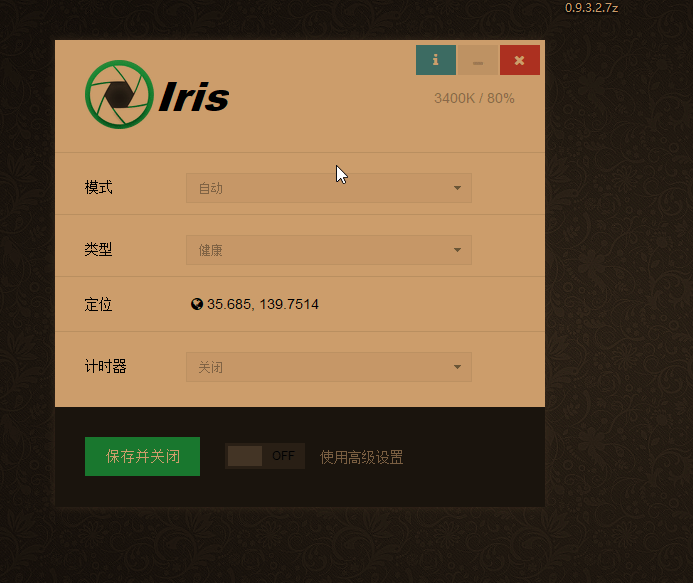

自从选择了这个编程行业，可以说，电脑陪我的是最多的了，而我的视力也真的是在不断的下降，现在的常态基本上都是在电脑前坐着。。。

不知道你是否也是这样

长时间看电脑的话会感觉眼睛痛，非常干涩，反正就是难受，所以很早我有两样必备物品。

1. 防蓝光眼镜
2. 眼药水

个人亲身体验有效，不过自从戴了这个眼睛，我就不知道跟别人解释过多少回这是防蓝光眼睛，我真的没有近视。。。。唉

不过自从接触这个软件，我的必备中需要加上它了------防蓝光护眼专家 Iris

这是一款专业的防蓝光软件，可以调整我们电脑屏幕的蓝光辐射量，从而起到对我们眼睛的保护作用，看一下这个软件的界面吧

这里的模式一般选择健康，也就是这个

我们可以看到，当你选择健康模式之后，屏幕立刻变得有点泛黄，你可以对比一下，长时间看电脑，哪一个会让你的眼睛更加舒服一点。

我们看到当我们选择使用高级设置之后会有很多的功能，我们可以自己摸索一下

不过这个软件是收费的，这里给大家提供了一个破解版的，里面有激活的步骤，大家可以按照要求操作即可。

传送门：<https://pan.lanzou.com/i0eqipi> 

